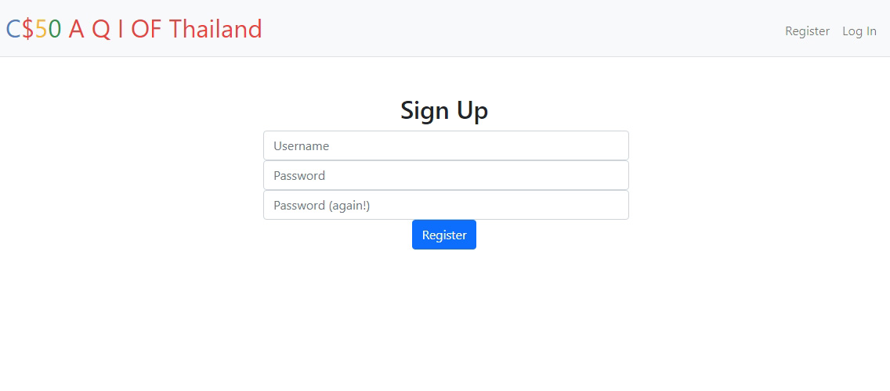
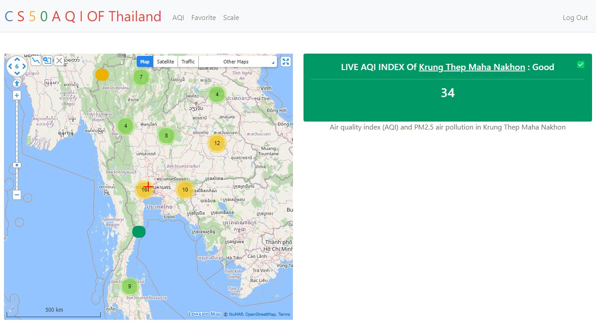
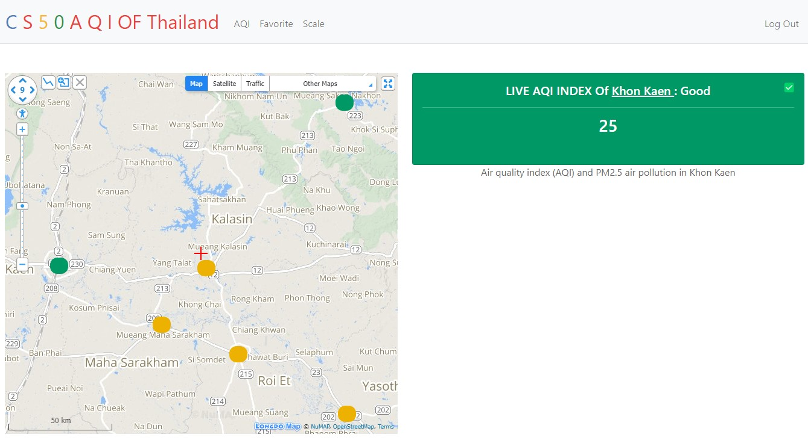
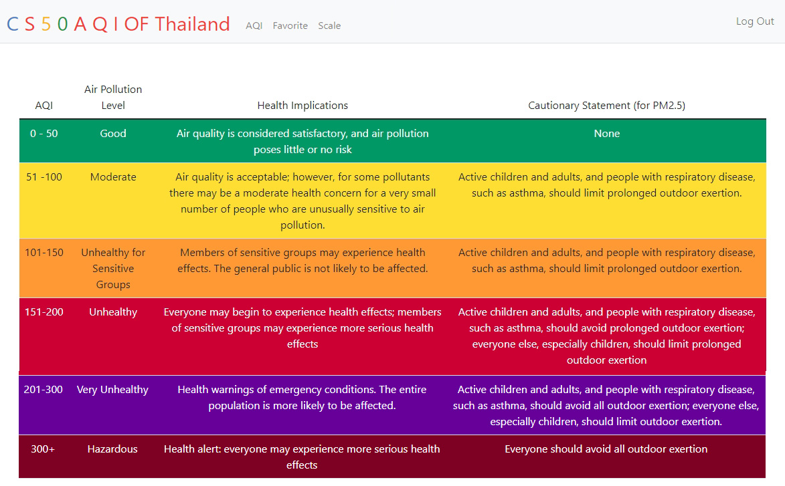
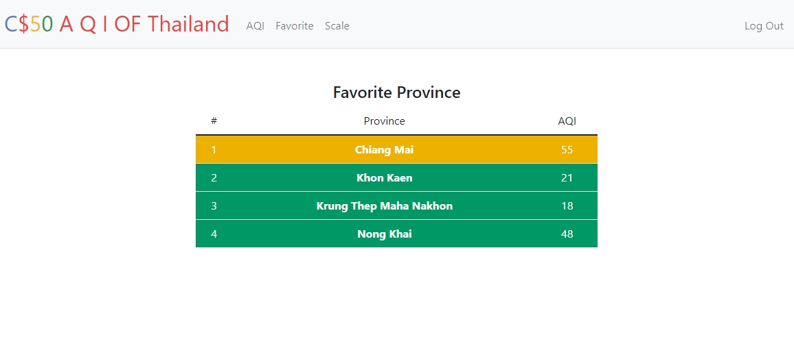

# Realtime AQI of Thailand By Napattra Supuckchookul

### Video Demo:  [View Demo On Youtube](https://www.youtube.com/watch?v=1hPr-r5V-rA)

---
The Air Quality Index (AQI) stands as a pivotal instrument in the assessment and dissemination of air quality information, with a particular focus on its implementation in Thailand—a nation grappling with severe air quality issues. In Thailand's pursuit of cleaner air, the AQI serves as a foundational tool, deriving its significance from the quantification of various air pollutant concentrations. It provides a uniform measurement scale for air quality, effectively communicating its health implications. The realization of being able to preemptively gauge air quality and protect our health is a transformative step forward.

---
## features
The core objective of this project is to establish a robust system for studying air quality in Thailand, leveraging an extensive network of strategically placed monitoring stations equipped with advanced sensors. This system is designed to continuously collect real-time data on a comprehensive range of air pollutants, including PM2.5, PM10, ozone, nitrogen dioxide, sulfur dioxide, and carbon monoxide. The project further enhances its reliability and efficiency through the application of Python programming and the integration of AirVisual's globally comprehensive air quality data.

In an era marked by escalating global environmental challenges, Thailand's adept utilization of the AQI showcases the nation's unwavering commitment to safeguarding public health and environmental equilibrium. The AQI transcends mere numerical metrics; it is a powerful tool that fosters awareness, proactive action, and ultimately, a healthier and more sustainable future for all.

---
## Installation
1. Clone the repository to your local machine.
```
git clone https://github.com/Cherrioooo/cs50finalproject
```
2. Install the necessary dependencies using pip.
```
pip install requests
```
3. Run the app using
```
flask run
```

---
## Usage
To use, simply navigate to the website and select the  regional or province you want to view air quality.

---
## Sign up
Certainly, here are the steps to sign up for View AQI:

1. Visit the Website: Open your web browser and navigate to the View AQI website.
2. "Register" button on the website's homepage. This button is usually found in the top right corner of the page.
3. Click the Sign-Up Button: Click on the "Sign-Up" button to initiate the registration process.
4. Provide Your Information:
      * Username: Enter a unique username that you'd like to use for your View AQI account. Make sure it meets any specific username requirements mentioned on the registration page.
    * Password: Create a strong password for your account. Ensure it includes a mix of uppercase and lowercase letters, numbers, and special characters for security.
    * Confirm Password: Re-enter the password to confirm it matches the one you provided above.
5. Click the "Register" button to submit your registration.

<center></center>

---
## Login
Upon running the web application, you will be redirected to the login page. If you have already registered for an account, you may input your username and password in order to log in and access the full site.

---
## How to viewing the Air Quality Index (AQI) 

1. Open Your Web Browser: Launch your preferred web browser on your computer or mobile device.
2. select the  regional or province you want to view air quality.
3. View AQI Data: Once you've selected your location, the website will display the AQI value for your area, often accompanied by a color-coded scale that indicates air quality conditions (e.g., good, moderate, unhealthy).

<center></center>
<center></center>
<center></center>

---
## Favorite province 
To view your Favorite province, Click on the "Favorite" tab in the navigation bar.

<center></center>

---

## Log Out
In order to log out of your account, you may click “Log Out”, which is located on the right side of the navigation bar. Upon logging out, you will be redirected to the login page.

---
## Credits
This project was developed by Napattra Supuckchookul.
Email: napattra.cher@newton.ac.th
